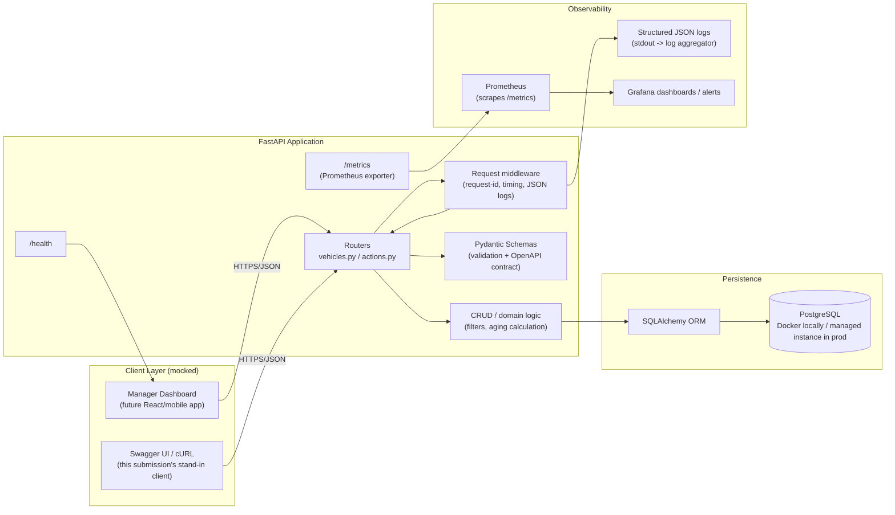

# System Design Document — Intelligent Inventory Dashboard (Backend)

**Scenario:** B — Intelligent Inventory Dashboard (Supply domain)
**Layer implemented:** Backend (RESTful API + persistent SQL database). Frontend is
mocked via cURL examples, Swagger UI, and a checked-in OpenAPI contract
(`openapi.json`).

## 1. Architecture Diagram

## 2. Component Roles

| Component | Role |
|---|---|
| **Routers** (`vehicles.py`, `actions.py`) | Own HTTP concerns: path/query params, status codes, request→response shaping. Thin — no business logic. |
| **Pydantic Schemas** (`schemas.py`) | Define and validate the request/response contract; double as the source of the generated OpenAPI spec. |
| **CRUD / domain layer** (`crud.py`) | All filtering logic and the aging-stock rule (`days_in_inventory > 90`) live here, independent of transport and framework — easy to unit test and reuse (e.g. from a future scheduled job). |
| **SQLAlchemy models** (`models.py`) | ORM mapping for `Vehicle` and `InventoryAction`; enums enforce valid status/action values at the DB layer too. |
| **Middleware** (`main.py`) | Assigns/propagates a request ID, times each request, and emits one structured log line per request — the backbone of the observability strategy. |
| **Database** | PostgreSQL, run via a one-command Docker Compose service locally (see README) and a managed instance (RDS/Cloud SQL/etc.) in production — no code changes between environments, only `DATABASE_URL`. |
| **Prometheus exporter** (`/metrics`) | Exposes request counts, latencies, and in-flight requests for scraping. |

## 3. Data Flow

1. A manager (or, today, a Swagger/cURL client) issues a request, e.g.
   `GET /vehicles?aging_only=true`.
2. Middleware assigns a request ID and starts a timer.
3. The router parses/validates query params via FastAPI's dependency-injected
   Pydantic types (invalid input → `422` before any DB hit).
4. `crud.list_vehicles()` builds a parameterized SQLAlchemy query — filters compose
   (make, model, status, dealership, age window, aging-only) rather than branching
   into separate endpoints.
5. Results are hydrated into `VehicleRead` schemas, computing `days_in_inventory` and
   `is_aging` **on read** from `date_received` (never stored/denormalized, so it's
   always correct with zero background jobs).
6. The response is serialized to JSON; middleware logs the outcome (path, status,
   duration, request ID) as one structured line.
7. **Action logging**: `POST /vehicles/{id}/actions` persists a `InventoryAction` row
   (status enum + free-text note + author) linked to the vehicle. The vehicle's
   `latest_action` is surfaced inline on `GET /vehicles` so a dashboard can render
   "aging + already being handled" vs. "aging + needs attention" without a second
   round trip.

## 4. Technology Choices & Justification

| Choice | Why |
|---|---|
| **Python** | My strongest language, so I could move fast and focus effort on the design instead of fighting the tools. |
| **FastAPI** | Generates the API docs straight from the code, so the spec can't drift out of sync. |
| **SQLAlchemy + Alembic** | Keeps the app portable across databases and gives clean, versioned migrations. |
| **PostgreSQL** | A solid, production-ready database that runs locally with one Docker command. |
| **Pydantic v2** | Fast validation, and doubles as the source for the API docs. |
| **UUID primary keys** | Safe to generate anywhere without a round trip, and don't reveal how many rows exist. |
| **Prometheus** | A standard, low-effort way to expose metrics that ops tools already know how to read. |

## 5. Observability Strategy

- **Logging**: every request emits one structured JSON log line (`request_completed`)
  with `request_id`, `path`, `method`, `status_code`, `duration_ms`. Domain events
  (`vehicle_created`, `inventory_action_logged`, etc.) are logged alongside with the
  same `request_id`, so a single grep/query reconstructs a full request's story.
  Unhandled exceptions are logged with `logger.exception` before the framework
  converts them to a 500, preserving the stack trace.
- **Request correlation**: an `X-Request-ID` is accepted from the caller (useful for
  a frontend to correlate a user action with server logs) or generated if absent, and
  is echoed back in the response header.
- **Metrics**: `/metrics` exposes request counts, latency histograms, and in-flight
  requests out of the box via `prometheus-fastapi-instrumentator`. In production this
  is scraped by Prometheus and visualized/alerted on in Grafana — e.g. alert if p95
  latency on `GET /vehicles` exceeds a threshold, or if 5xx rate spikes.
- **Health check**: `/health` for load balancer / orchestrator liveness checks.
- **Domain metric worth adding next**: a scheduled job re-computing `aging_vehicle_count`
  per dealership and pushing it as a gauge, so "how much aging stock exists right now"
  is visible on an ops dashboard without querying the API.
- **Tracing**: not implemented in this scope (single service, no downstream calls yet),
  but the request-ID propagation is the seam where OpenTelemetry spans would attach if
  a second service (e.g. a pricing recommendation service) is introduced.

## 6. Testing Strategy

Tests run with pytest against a fresh, isolated in-memory database for each test, so
there's no shared state between tests and no need for a running Postgres instance to
run the suite. Coverage includes:

- CRUD happy paths and error cases (duplicate VIN, missing vehicle).
- Filter combinations (make/model, status, age windows).
- The aging-stock boundary, which caught a real off-by-one bug during development
  (see the README's "AI Collaboration Narrative").
- Aging summary math (count, percentage, oldest-in-stock).
- Action logging, ordering, and its effect on `latest_action`.

## 7. Future Work (out of scope for this submission)

- AuthN/AuthZ (e.g. OAuth2/JWT) and enforcing `dealership_id` as a tenant boundary.
- Alembic migrations wired into CI/CD (schema is currently created via
  `Base.metadata.create_all`, fine for this exercise, not for a real production
  rollout with existing data).
- Pagination cursor instead of offset/limit for very large inventories.
- A scheduled aging-stock digest (email/Slack) using the same `crud.aging_summary()`
  logic already exposed via the API.
